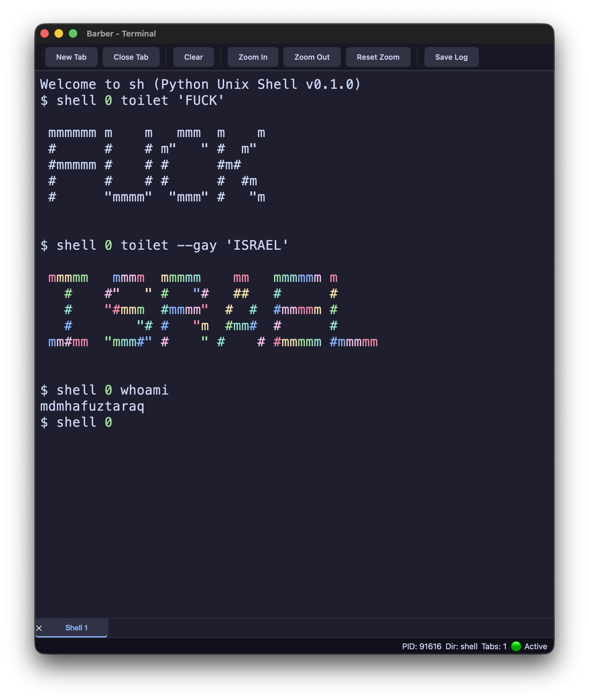

# sh - Unix Shell & PyQt6 Terminal Emulator (Barber)

A custom Unix shell implemented in Python featuring AST-based command parsing, pipeline execution, stream redirections, job control, and a native **PyQt6 Desktop Terminal Emulator** (Barber).

---

## Overview & Architecture

- **CLI Shell (`sh`)**:
  - Interactive REPL with Readline autocompletion and persistent history (`~/.mysh_history`).
  - Abstract Syntax Tree (AST) parser supporting quoted strings, tilde expansion (`~`), environment variables (`$VAR`), and exit codes (`$?`).
  - Stream redirection operators (`>`, `>>`, `2>`, `2>&1`, `&>`, `&>>`, `<`).
  - Pipeline chaining (`cmd1 | cmd2 | cmd3`) with in-process builtin interoperability.
  - POSIX builtins: `cd` (logical `-L`, physical `-P`, and toggle `cd -`), `pwd`, `type`, `echo`, `jobs`, `history`, and `exit`.
  - Non-blocking job control for background tasks (`command &`).

- **Desktop GUI Terminal (`sh_gui` / Barber)**:
  - Custom `QPainter` 2D character grid canvas backed by `pyte` VT100/Xterm terminal state parsing.
  - Full support for alternate screen buffer applications (`vim`, `top`, `nano`, `less`, `man`) via `AltScreenBufferScreen` (DEC modes 1049, 1047, 47).
  - 256-color and TrueColor theme palette mapping (`PYTE_256_ANSI_MAP`) with single uniform background rendering in alternate screen mode.
  - Multi-tab management, dynamic current working directory status bar metrics (`Dir: <cwd>`), font zooming, log exporting, and copy/paste integration.

---
## Fuck Israel

<a href="terminal.png">
  
</a>


## Quick Start

### 1. Set Up Virtual Environment

```bash
# Create virtual environment
python3 -m venv .venv

# Activate virtual environment
source .venv/bin/activate

# Install dependencies (PyQt6 & pyte)
pip install PyQt6 pyte
```

### 2. Launch the CLI Shell

```bash
python3 -m sh
```

### 3. Launch the Desktop GUI Terminal (Barber)

```bash
python3 -m sh_gui
```

---

## GUI Keyboard Shortcuts

| Shortcut | Action |
| --- | --- |
| `Cmd+T` / `Ctrl+T` | Open New Terminal Tab |
| `Cmd+W` / `Ctrl+W` | Close Active Terminal Tab |
| `Cmd+V` / `Ctrl+V` | Paste Clipboard Text |
| `Cmd+=` / `Cmd+-` | Zoom In / Zoom Out Font Size |
| `Cmd+0` | Reset Font Zoom to Default (13pt) |
| `Ctrl+L` | Clear Terminal Screen |

---

## Documentation

- **[docs/architecture.md](docs/architecture.md)**: System design, module breakdown, AST data structures, and PTY execution flow.
- **[docs/design_decisions.md](docs/design_decisions.md)**: Architectural rationale, process model, and GUI grid rendering decisions.
- **[docs/shell.1](docs/shell.1)**: Unix man page specification.

